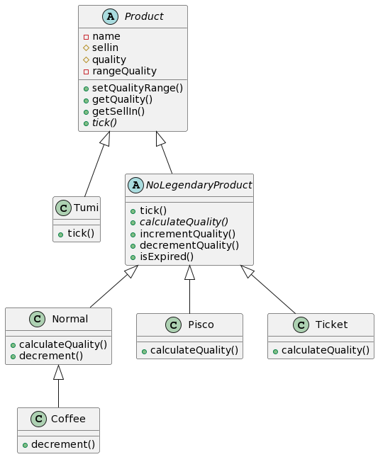
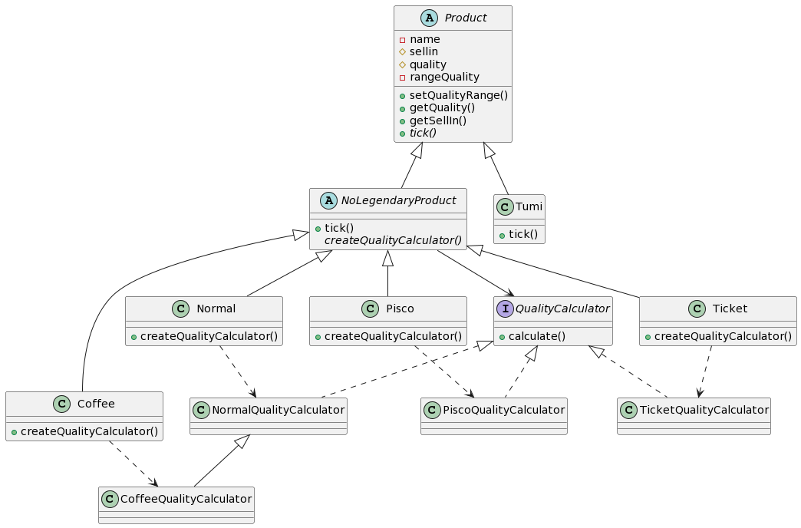
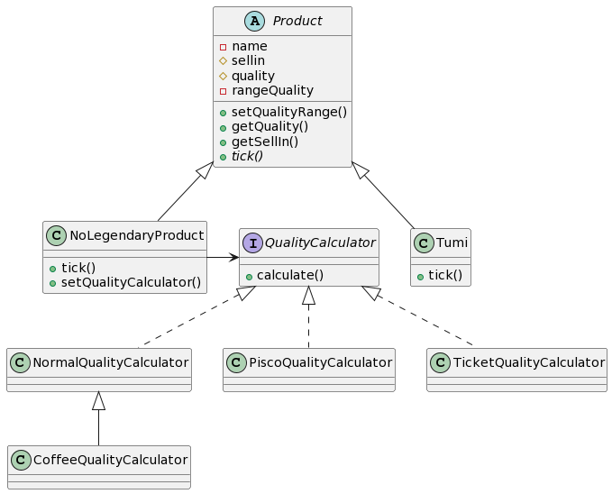

# Talently Challenge

## Configuración

Este repositorio incluye la configuración inicial para este problema, incluyendo los specs. Usa la librería
de [Kahlan](http://kahlan.readthedocs.org/en/latest/), que probablemente no has usado. Pero no te preocupes, no hay
mucho que aprender. Revisa los specs y entenderás la sintaxis básica en menos de un minuto.

Tu tarea es:

1. Refactorizar el código en la clase `VillaPeruana.php`.
2. Agregar un nuevo typo de elemento, "Café". Las especificaciones para este elemento están comentadas en el
   archivo `VillaPeruanaScpec.php`.

## Flujo

Debes tener instalado docker en tu computadora para usar nuestros comandos del flujo de trabajo

- Usa el comando `./start` para inicializar el docker
- Usa el comando `./test` para correr los tests
- Usa el comando `./finish` para desactivar el docker

# Reglas

Hola y bienvenido al equipo La Villa Peruana. Como sabes, somos una pequeña posada, con una excelente ubicación en una
ciudad importante, administrada por nuestra amigable Allison. También compramos y vendemos los más finos productos.
Desafortunadamente, nuestros productos se van desgradando constantemente en calidad conforme se acercan a su fecha de
vencimiento. Tenemos un sistema que actualiza nuestro inventario por nosotros. Fue desarrollado por un desarrollador
llamado Elmo, quien ha ido en busca de nuevas aventuras.

Queremos agregar una nueva categoría de productos al sistema y para ello necesitamos tu ayuda.

Primero, una introducción a nuestro sistema:

- Todos los productos tienen un SellIn que denota el número de días que se tienen para vender el producto
- Todos los productos tienen un Quality que denota cuán valioso es el producto
- Al final de cada día, nuestro sistema disminuye los ambos valores para cada producto

Bastante simple, ¿verdad? Bueno, acá se pone interesante:

- Cuando la fecha de venta ha pasado, el Quality se degrada dos veces más rápido
- El Quality de un producto nunca es negativo
- Los productos "Pisco Peruano", en realidad, incrementan en Quality mientras más viejos están
- El Quality de un producto nunca es mayor a 50
- Los productos "Tumi", siendo un producto legendario, nunca debe ser vendido o bajaría su Quality
- Los "Tickets VIP", así como "Pisco Peruano", incrementan su Quality conforme su SellIn se acerca a 0, el Quality
  incrementa en 2 cuando faltan 10 días o menos y en 3 cuando faltan 5 días o menos, pero el Quality disminuye a 0
  después del concierto.

Recientemente hemos firmado un contrato con un proveedor de productos de "Café". Esto require una actualización para
nuestro sistema:

- Los productos de "Café" se degradan en Quality el doble que los productos normales

Para dejarlo claro, un producto nunca puede incrementar su Quality mayor a 50, sin embargo "Tumi" es un producto
legendario y como tal su Quality es 80 y nunca cambia.

# Entregable o Expectativa del reto

- Será indispensable el uso de los principios S.O.L.I.D.
- Organización de código
- Manejo de errores
- Deseable el uso de Domain drive design (usa los conceptos de ddd, aggregates, value objects, domain services, etc)
- La limpieza y legibilidad del código será considerada.
- La eficiencia del código en cuestiones de rendimiento sumarán para esta prueba.
- Al finalizar el reto, enviar el enlace de la solución a emmanuel.barturen@talently.tech con copia a
  paula.anselmo@talently.tech con título "Reto Talently Backend"

## Soluciones implementadas

Se implementaron tres soluciones distintas, cada una válida dependiendo de la complejidad del requisito:

### Inheritance

En el paquete `Inheritance` se implementó la solución con una jerarquía de herencia cuya raíz es la clase
abstracta `Product`, a partir de esta clase raíz se implementan 2 clases, la clase `Tumi` que por ser un producto
legendario tiene sus particularidades y la clase abstracta `NoLegendaryProduct` que son todos los otros casos que tienen
métodos particulares y distintos a la de `Tumi`, en esta solución se implementó el patrón de diseño "Template Method" en
el que como parte del método `tick()` llama a un método abstracto `calculateQuality()` que es implementado en los hijos
concretos de `NoLegendaryProduct` que dependiendo de su tipo implementan un cálculo u otro. Para el problema planteado
inicialmente, esta sería una buena solución.

A continuación se muestra el diagrama de clase de la solución:



### Factory Method

En el paquete `FactoryMethod` se implementó la solución con la aplicación del patrón de diseño "Factory Method", la
diferencia respecto a la solución anterior es que `NoLegendaryProduct` es la que ejecuta el cálculo apoyado de un
asociado que es una implementación de `QualityCalculator`, que a su vez es creado por cada hijo concreto de
`NoLegendaryProduct` en su método creador. La ventaja de esta solución es que al desacoplar el algoritmo, permite crear
un
nuevo tipo de producto y reutilizar un algoritmo ya creado para otro tipo de producto.

A continuación se muestra el diagrama de clase de la solución:



### Strategy

En el paquete `Strategy` se implementó la solución con la aplicación del patrón de diseño "Strategy", la diferencia
respecto a la solución anterior es que `NoLegendaryProduct` va a realizar el cálculo dependiendo del objeto
`QualityCalculator` inyectado. La ventaja de esta solución es que va a permitir cambiar el cálculo de la calidad en
tiempo
de ejecución, es decir un producto puede ser creado con cálculo inicial y al cabo de unos días si habría la necesidad
de cambiar este algoritmo solo sería cuestión de inyectarle otro objeto.

A continuación se muestra el diagrama de clase de la solución:



* Nota: En cada paquete se implementó la clase `ProductBuilder` donde se implementó el patrón de diseño "Builder" para
  crear objetos de la clase `Product` que son usados en los test, la implementación de este patrón está justificada ya
  que permite desacoplar la creación de un producto de los tests.

# Preguntas de conocimiento en Laravel

1. ¿Qué paquete o estrategia utilizarías para levantar un sistema de administración rápidamente? (Autenticación y CRUDs)

Para levantar un sistema de administración rápidamente trabajaría con dos tipos de librerías:

- [Laravel UI](https://github.com/laravel/ui) para configurar rápidamente la interface gráfica y la autenticación de los
  usuarios
- Un generador de CRUDs ya sea [ibex/crud-generator](https://github.com/awais-vteams/laravel-crud-generator)
  o [Grocery CRUD](https://www.grocerycrud.com/docs/grocery-crud-enterprise-laravel-8-installation) o cualquier otro que
  se adapte a las necesidades del proyecto

2. Una breve explicación de cómo laravel utiliza la inyección de dependencias

Laravel cuenta con contenedor de servicios que permite fácilmente inyectar dependencias en controladores, rutas,
middlewares, etc. En la mayoría de casos no es necesario realizar configuraciones previas, pero en otros casos si
requiere que se registre el proveedor del servicio en el contenedor de servicios.
La inyección de dependencias se puede realizar agregando como argumento en el constructor de una clase o directamente
como argumento de un método como se muestra a continuación:

```
public function __construct(OrderRepository $orders) {
  ...
}
```

Algunas dependencias como el Request ya están registradas por defecto en el contenedor de servicios y solo es cuestión
de invocarlos

```
public function store(Request $request) {
  ...
}
```

3. ¿En qué casos utilizarías un Query Scope?\
   Uso scope en los siguientes casos:

- Cuando hay una condición que se repite en un determinado modelo y así reutilizo código
- Para mejorar la legibilidad
- Para encadenar mensajes en un query builder y facilitar su lectura

4. ¿Qué convenciones utilizas en la creación e implementación de migraciones?\
   Para la creación e implementación de migraciones utilizo las siguientes convenciones:

- Utilizo un estándar en el nombrado dependiendo del objetivo de la migración: Ej.: `create_tableName_table`,
  `add_columnName_to_tablename_table`, `update_columnName_to_tablename_table`, `remove_columnName_from_tablename_table`,
  etc.
- Uso el comando `php artisan make:migration create_flights_table` para que al nombre se agregue la fecha y hora en el
  nombre de archivo y así evitar fallos en el orden de ejecución de las migraciones
- Cada migración debe tener un único objetivo, es decir en una misma migración no puede haber un "create table" y
  luego llenar los datos por defecto de esta
- Mantengo el estándar de los nombres de los campos cuando son claves foráneas de otras tablas, para ello
  uso: `$table->foreignId('order_id')->constrained();`
- El nombre de las tablas siempre en plural